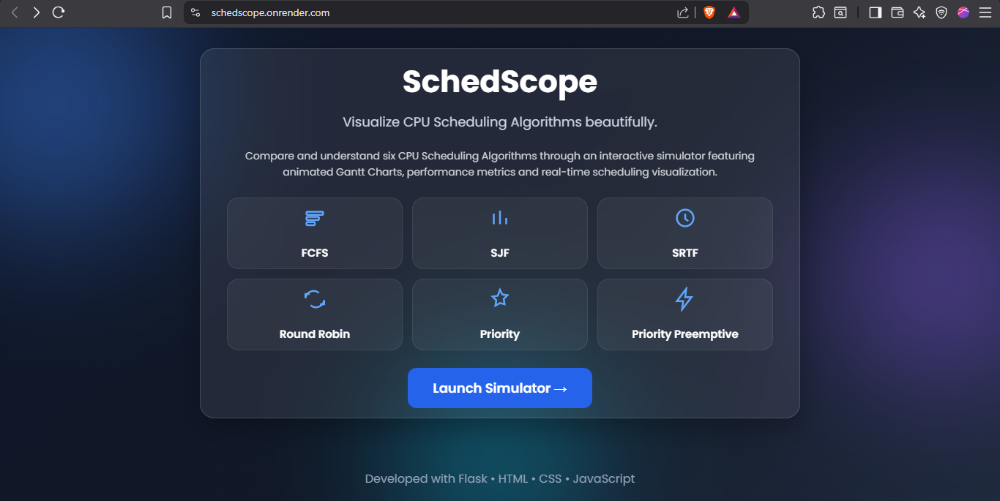
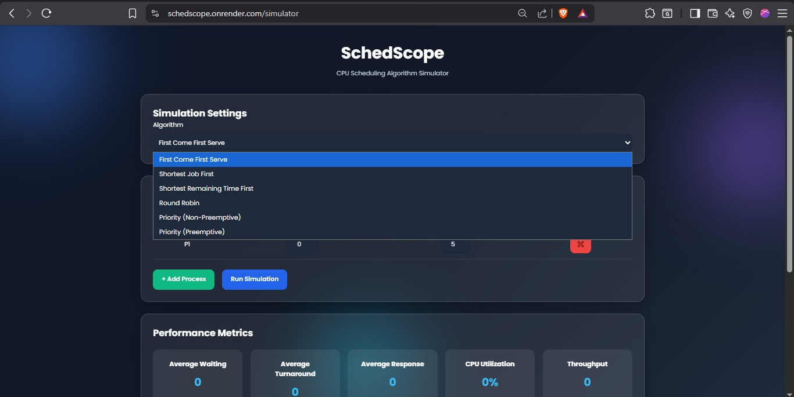
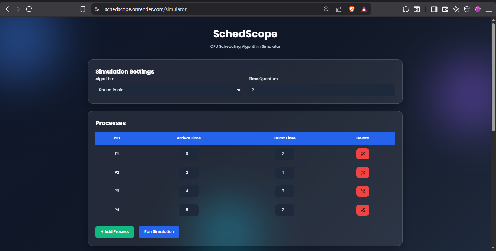
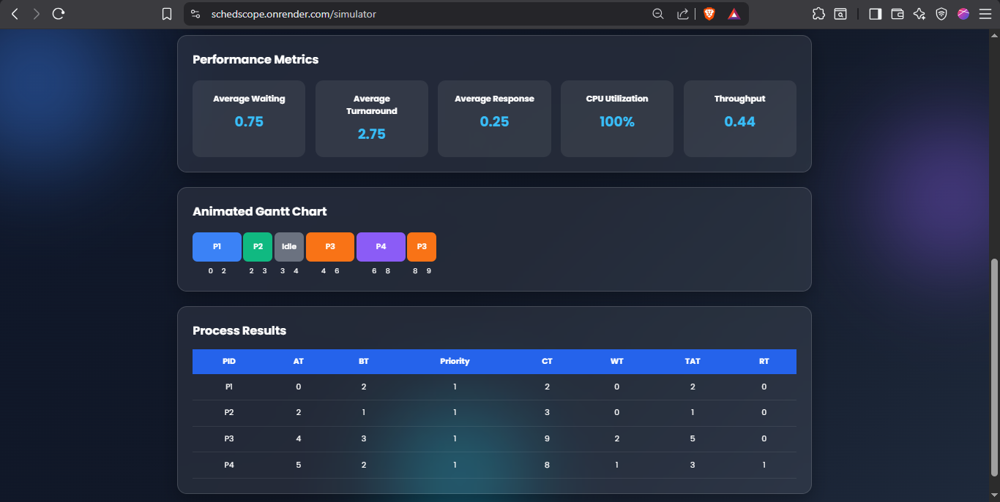

<div align="center">

# SchedScope

### Interactive CPU Scheduling Algorithm Simulator

Visualize and compare CPU scheduling algorithms through an intuitive web interface featuring animated Gantt charts and real-time performance metrics.

🌐 **Live Demo:** https://schedscope.onrender.com

</div>

---

## Overview

SchedScope is a web-based CPU Scheduling Simulator built using **Flask, Python, HTML, CSS, and JavaScript**. It provides an interactive way to understand how different CPU scheduling algorithms execute processes by visualizing execution order, Gantt charts, and scheduling metrics.

---

## Screenshots

<p align="center">


</p>

<p align="center">


</p>

---

## Features

- Interactive CPU Scheduling Simulator
- Animated Gantt Chart Visualization
- Real-time Scheduling Metrics
- Process Management with Input Validation
- Responsive Glassmorphism UI
- Live Web Deployment

---

## Implemented Algorithms

- First Come First Serve (FCFS)
- Shortest Job First (SJF)
- Shortest Remaining Time First (SRTF)
- Round Robin (RR)
- Priority Scheduling (Non-Preemptive)
- Priority Scheduling (Preemptive)

---

## Performance Metrics

- Average Waiting Time
- Average Turnaround Time
- Average Response Time
- CPU Utilization
- Throughput

---

## Tech Stack

- **Backend:** Flask, Python
- **Frontend:** HTML5, CSS3, JavaScript
- **Deployment:** Render
- **Version Control:** Git & GitHub

---

## Run Locally

```bash
git clone https://github.com/Sreya2911/SchedScope.git
cd SchedScope
pip install -r requirements.txt
python app.py
```

Open:

```
http://127.0.0.1:5000
```

---

## Author

**Sreya S**

- GitHub: https://github.com/Sreya2911
- LinkedIn: https://www.linkedin.com/in/ssreya/

---

<p align="center">

Built to simplify the visualization of CPU Scheduling Algorithms.

</p>
